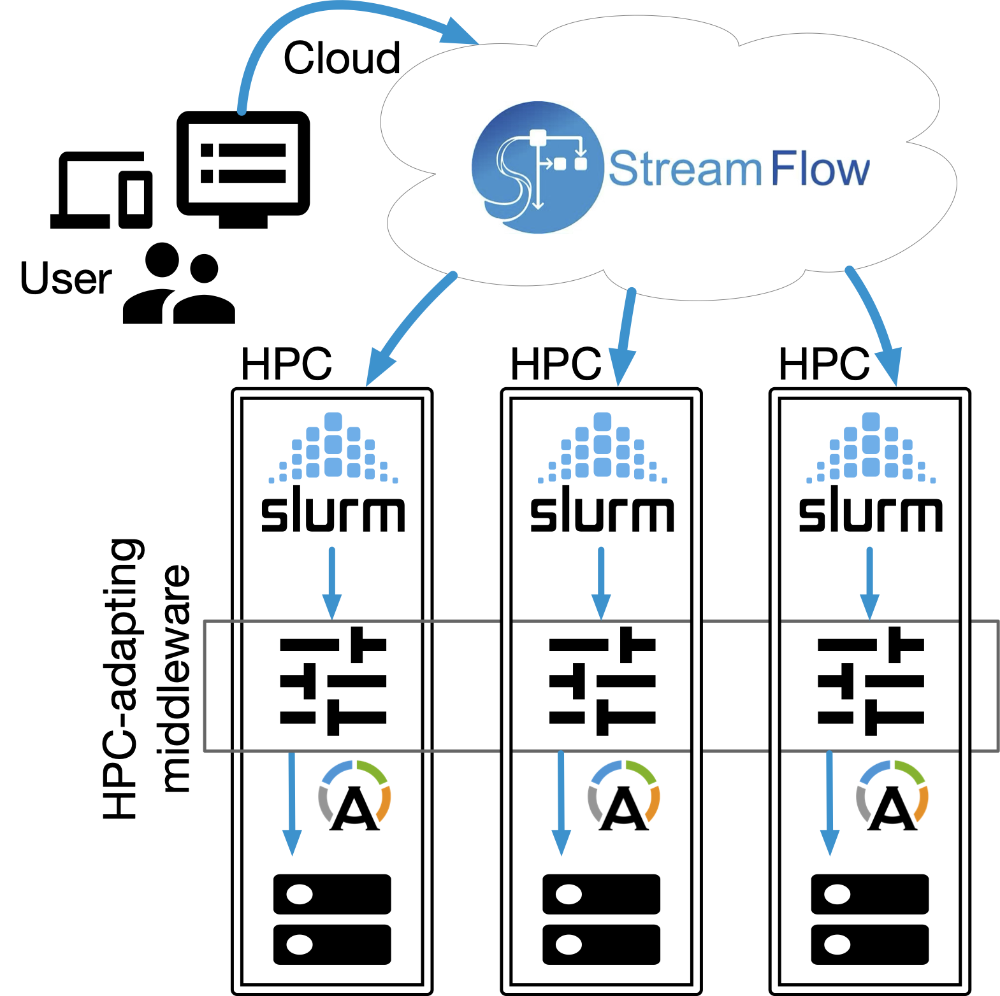
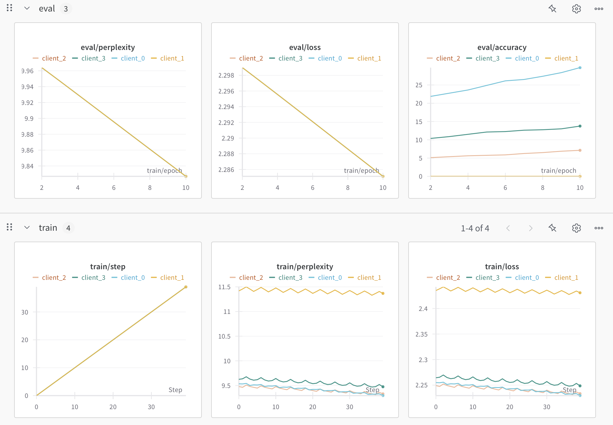

# Federated Learning for Foundation Models tutorial

This is a step by step tutorial illustrating how to use [Cross-Facility Federated Learning](https://github.com/alpha-unito/xffl) (xFFL) to run a locally simulated federation on Leonardo. Students will be asked to write basic Python code on their own, while the xFFL part will be guided; all coding will be done remotely on Leonardo. Students are encouraged to use tools such as VisualStudio Code to be able to edit remote source files easily.



This tutorial provides three different xFFL examples, which can be found in the xffl/examples/simulation folders:
1. simple MLP: this tutorial offers an xFFL template training script to be completed from the student to **train a simple MLP on MNIST**. The MNIST dataset is alredy present on the Leonardo $PUBLIC file system (/leonardo/pub/userexternal/gmittone/data).
2. simple CNN: this tutorial offers an xFFL training script to **train a ResNet on CIFAR10**. The CIFAR10 dataset is alredy present on the Leonardo $PUBLIC file system (/leonardo/pub/userexternal/gmittone/data). Students can play around with the size of the ResNet and the data distribution.
3. simple LLM: this tutorial offers an xFFL training script to **train LLaMA3.1-8B on clean_mc4_it**. The clean_mc4_it dataset is alredy present on the Leonardo $PUBLIC file system. Students can experiment with running both FSDP/HSDP and FL simoultaneously.

Such scripts are designed to be completed and/or run by the students, who can subsequently observe the obtained results through [WandB](https://wandb.ai).



Spoiler: *the aggregation is not yet implemented!*

# On the frontend node
Here internet is available, but no heavy computation can be run (i.e., no GPUs here).

### Setup the SSH key for accessing the nodes through SSH
*After* accessing the Leonardo cluster, students are requested to setup a local SSH keys to allow SSH access to the compute nodes. Please execute the following commands in your $HOME folder on the Leonardo frontend node:
```
ssh-keygen -t rsa
cd .ssh
touch authorized_keys
cat id_rsa.pub >> authorized_keys
```

### Clone the repository and setup the Python virtual environment
It is necessary to clone this repository, create a Python virtual environment and install the xFFL framework that comes with it:
```
git clone https://github.com/Sera91/SMR4088.git
cd SMR4088/Federated_Learning/xffl/
python3.11 -m venv .venv
source .venv/bin/activate
pip install --upgrade pip
pip install .
```

### Prepare the first example
To get started with the simple MLP tutorial, enter its folder and intall the specific example's requirements:
```
cd examples/simulation/01_simple-MLP/
pip install -r requirements.txt
```

### Get computational resources
Submit to SLURM a request to have 2 GPUs on one compute node in an interactive session:
```
srun -A tra25_ictp_scd --reservation s_tra_ictp_scd_2 --partition boost_usr_prod --time 01:00:00 --gpus-per-node 2 --nodes 1 --pty /bin/bash
```

## On the compute node:
Here internet is not available, but GPUs are available.

To run an xFFL training script locally, the ```xffl simulate``` command can be used.

### Run example 1
All the arguments after "-args" are referred to the training script:
```
xffl simulate training.py -v ${HOME}/SMR4088/Federated_Learning/xffl/.venv -p 2 -args --seed 42 -e 3 -wb -mode offline -name MLP -oc
```
To toggle on the federation, add ```-fs 1```

Complete command line arguments information can be found in the ```parser.py``` file.

### Run example 2
All the arguments after "-args" are referred to the training script:
```
cd ../02_CNN/
xffl simulate training.py -v ${HOME}/SMR4088/Federated_Learning/xffl/.venv -p 4 -args --seed 42 -e 10 -fs 1 -wb -mode offline -name CNN_4c_10e_oc -oc
```

### Run example 3
All the arguments after "-args" are referred to the training script:
```
cd ../03_LLM/
xffl simulate training.py -v ${HOME}/SMR4088/Federated_Learning/xffl/.venv -p 4 -args -m llama3.1-8b -d clean_mc4_it --seed 42 --subsampling 128 -fs 2 -wb -mode offline -name LLM_2c_128t
```

# Synch WandB runs (on the frontend):
Once the training is done, wandb run can be uploaded and visualized on the web:
```
cd wandb_folder
wandb sync offline-run-*
```
